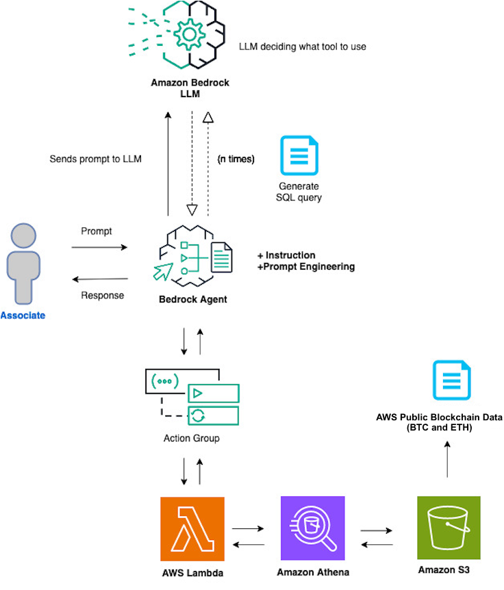

# Bedrock Blockchain Data Agent
This repository demonstrates how Amazon Bedrock Agents can be used to enable natural language queries of Bitcoin and Ethereum blockchain data. For example, it can provide responses to questions like:
* how many transactions happened on Bitcoin yesterday?
* how much USDC was transferred last week?

For the second question, the agent infers this is for Ethereum so it does not need to be specified in the question.

So how does it work? The agent is provided a set of instructions which indicate what it should do, what the data source schema is, how to handle error cases by retrying, and many more things. The complete instructions can be found in the [agent stack definition](./lib/bedrock-blockchain-data-agent-stack.ts).

The agent is also configured via its orchestration instructions, which orchestrates how it should process input and which [action group](https://docs.aws.amazon.com/bedrock/latest/userguide/agents-action-create.html) to invoke.

This deployment uses the Bitcoin and Ethereum data sets from [AWS Public Blockchain Data](https://registry.opendata.aws/aws-public-blockchain/) and deploys [an Athena-based stack](./lib/aws-public-blockchain.yaml) to support querying the data sets which are in Amazon S3.

Note, this CDK deploys the Bedrock Agent by using [experimental CDK constructs](https://www.npmjs.com/package/@cdklabs/generative-ai-cdk-constructs) that are liable to change.

### Installation

**Prerequisites:** The [AWS CDK](https://docs.aws.amazon.com/cdk/v2/guide/getting_started.html#getting_started_install) should be installed and [Docker](https://www.docker.com/) should be running.

After cloning the repository, install the necessary dependencies:

```javascript
npm install
```

Configure your AWS profile:
```javascript
aws configure
```

If this is your first time deploying a CDK stack in this AWS account, you need to first [bootstrap your environment](https://docs.aws.amazon.com/cdk/v2/guide/bootstrapping.html#bootstrapping-howto) by running:
```javascript
cdk bootstrap aws://<ACCOUNT_NUMBER>/<REGION>
```

Deploy the CDK stack:
```
cdk deploy BedrockBlockchainDataAgentStack --profile <aws-profile-name> // The --profile is optional; if omitted the default profile will be used
```

It takes approximately two minutes for the CDK to be deployed. 

### Testing
Now that the CDK stack has been deployed, you can test it within the Bedrock console.

**Note:** If this is your first time using Amazon Bedrock, navigate to [Model access](https://us-east-1.console.aws.amazon.com/bedrock/home?region=us-east-1#modelaccess) on the left sidebar of the Bedrock Console and enable access for Claude 3 Haiku. You can alternatively enable access for all available models. 

1. Navigate to the Amazon Bedrock service in the AWS Console and choose [Agents](https://us-east-1.console.aws.amazon.com/bedrock/home?region=us-east-1#agents) under the Orchestration tab on the left sidebar.
2. Select the newly created Agent that starts with the name "bedrock-agent-*"
3. Enter a natural language question in the **Test** prompt window and click `Run`. Use the sample questions below as starting points, but be sure to test the agent with your own questions.

### Sample questions
**BTC Questions**
1. Find the total number of bitcoin transactions that occurred in the last 24 hours
2. identify the largest bitcoin transaction in the last 24 hours
3. calculate the average block size over the last day 
4. what is satoshi’s message that he stored in the genesis block? 

**ETH Questions**

1. get the number of new ethereum contracts created in the last week 
2. find the most active ethereum address in the last 7 days
3. calculate the total value of all token transfers in the ethereum network in the last 30 days
4. identify the largest ethereum transaction in the last month
5. what is the largest ether transfer in the past week
6. what transaction has paid the most gas
7. what are various reward_types of ethereum transactions
8. how many uncle transactions were on ethereum in the past week
9. how many uncle transactions happened on ethereum on august 1 2022


### Architecture



### Clean up
To remove all created resources, run `cdk destroy`.

